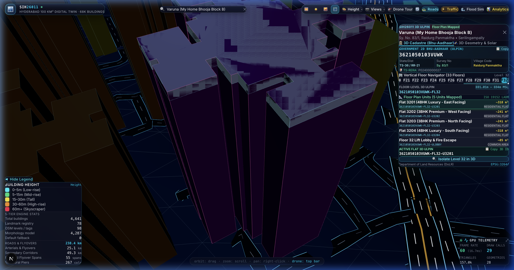
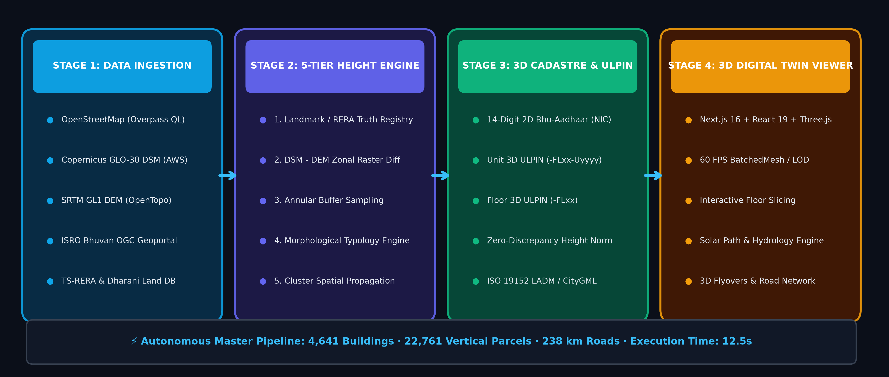
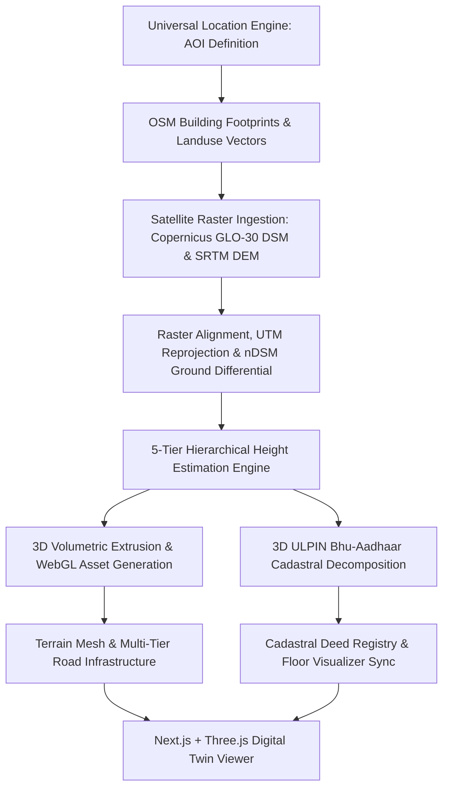
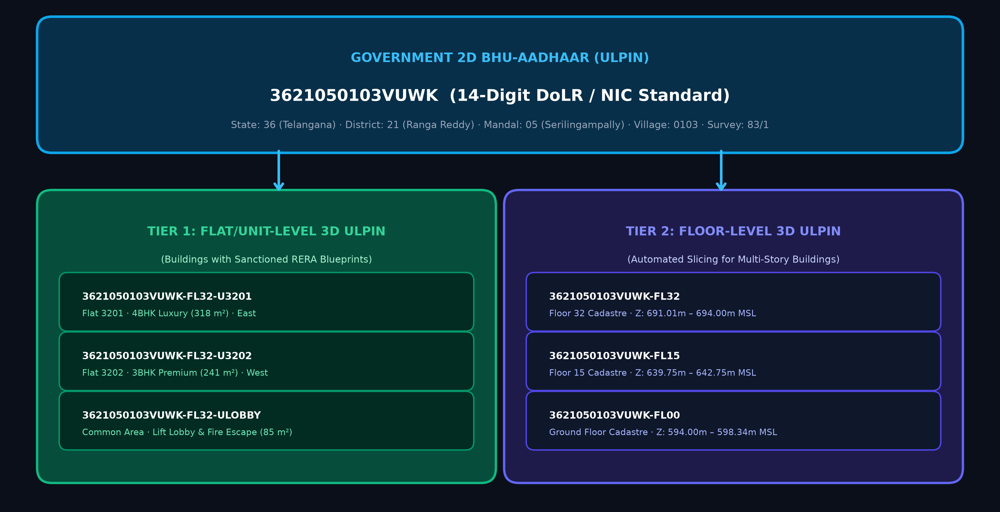
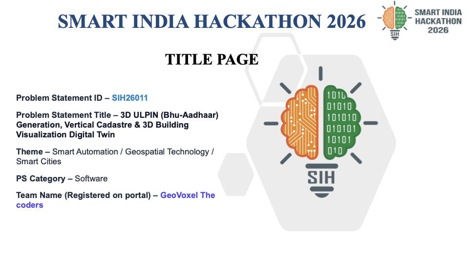

# 🌐 GeoVoxel-3D — 3D Cadastre & Spatial Digital Twin Pipeline

<div align="center">


-violet?style=for-the-badge)


<br/>

**An autonomous geospatial intelligence pipeline and high-performance WebGL digital twin that transforms 2D cadastral records and open satellite data into 3D volumetric buildings with vertical Bhu-Aadhaar (3D ULPIN) parcel subdivision.**

[🚀 Live Interactive Viewer](#-interactive-webgl-viewer) • [🏗️ Architecture & Pipeline](#️-system-architecture) • [📜 3D Cadastre & Bhu-Aadhaar](#-3d-cadastre--bhu-aadhaar-ulpin-engine) • [📐 5-Tier Height Engine](#-5-tier-hierarchical-height-estimation-engine) • [📊 Presentation Decks](#-sih-2026-official-presentation-deliverables) • [⚡ Quick Start](#-quick-start)

</div>

---

## 📸 Prototype Showcase

<div align="center">


*Interactive 3D Digital Twin Viewer rendering 4,641 extruded structures, multi-tier elevated flyovers, terrain elevations, dynamic time-of-day illumination, and the 3D Floor Cadastral Inspector in Durgam Cheruvu / HITEC City, Hyderabad.*

</div>

---

## 🌟 Executive Summary

Traditional cadastral systems in India represent land ownership strictly in two dimensions ($X, Y$). However, contemporary urban centers feature dense high-rises, multi-unit residential condominiums, commercial IT campuses, and multi-tier transport corridors. Flat 2D land records (Pahani / Dharani / RoR) fail to reflect vertical property boundaries, leading to:
- **Disputed Property Boundaries:** Ambiguity in undivided share of land (UDS) and vertical air rights.
- **Municipal Revenue Leakage:** Inaccurate built-up area records and unassessed property taxes.
- **Urban Planning Blindspots:** Inability to simulate vertical density, flood risk, solar insolation, or emergency egress routes.

**GeoVoxel-3D** addresses **Problem Statement SIH26011** by delivering a fully automated, production-grade platform that:
1. **Ingests Open & Authoritative Data:** Fuses OpenStreetMap (OSM) building footprints and landuse polygons with Copernicus DEM GLO-30 Digital Surface Models (~30m) and SRTM bare-earth Digital Elevation Models.
2. **Infers High-Precision 3D Heights:** Deploys a **5-Tier Hierarchical Inference Engine** combining physical nDSM ground differentials, annular ground-ring filtering, authoritative skyscraper registries, and spatial clustering (`cKDTree`).
3. **Pioneers 3D Bhu-Aadhaar (3D ULPIN):** Decomposes buildings into vertical cadastral parcels compliant with the **Department of Land Resources (DoLR)**, **NIC LGD**, and **ISO 19152 (LADM)** international standards.
4. **Delivers a WebGL Spatial Digital Twin:** Powers an interactive 60+ FPS web viewer built with **Next.js 16**, **React 19**, and **Three.js** (featuring BatchedMesh, dynamic solar potential analysis, flood inundation simulation, and exploded unit-level floor inspections).

---

## 🏆 Key Verified Metrics (Hyderabad Pilot AOI)

| Metric | Measured Value | Description |
|:-------|:---------------|:------------|
| **Total Buildings Extruded** | **4,641** | Extruded 3D prismatic solids from OSM vector footprints |
| **2D Land Parcels Mapped** | **4,641** | 100% coverage with standard 14-character DoLR ULPINs |
| **3D Vertical Parcels (ULPINs)** | **22,761** | Unique volumetric cadastral units with vertical indexing |
| **Total Floors Mapped** | **21,986** | Vertical floors indexed with elevation offsets and heights |
| **Architectural Floor Plans** | **9 Complex Landmarks** | Detailed flat-level decomposition with registered deed data |
| **Vertical Density Ratio** | **4.9×** | Ratio of 3D vertical units to surface 2D land parcels |
| **Total Footprint Area** | **1,584,220 m²** (~1.58 km²) | Total ground surface area covered by building footprints |
| **Gross Built-Up Volume** | **60,374,287 m³** (~60.37M m³) | Total 3D extruded volume across the 9 km² pilot bounding box |
| **Gross Floor Area (GFA)** | **17,520,501 m²** | Total usable floor space estimated across all floors |
| **Road Infrastructure Length** | **230+ km** | Multi-tier road network with elevated flyovers & concrete piers |
| **Annual Rooftop Solar PV** | **429,343 MWh/year** | Clean energy potential yielding **352,061 tons CO₂ offset/year** |

---

## 🏗️ System Architecture

GeoVoxel-3D operates through an end-to-end, decoupled pipeline that transforms raw raster and vector satellite data into interactive 3D web datasets and authoritative cadastral ledgers:

<div align="center">



</div>

### 10-Stage Autonomous Data Pipeline (`scripts/pipeline.py`)



| Stage | Name | Key Operations |
|:------|:-----|:---------------|
| **1** | **AOI Definition** | Bounding box calculation, CRS determination (EPSG:4326 to UTM Zone 44N / EPSG:32644), area verification (~9 km²). |
| **2 & 2b** | **Vector Ingestion** | Overpass API downloads building polygons and landuse zoning (commercial, IT park, residential, retail). |
| **3 & 4** | **Elevation Ingestion** | Copernicus GLO-30 DSM (AWS S3) and SRTM GL1 bare-earth DEM (OpenTopography API) acquisition. |
| **5** | **Raster Conditioning** | Reprojection to UTM, bilinear resampling, boundary clipping, and nDSM calculation (`nDSM = DSM - DEM`). |
| **6** | **Height Estimation** | 5-tier hierarchical fusion combining verified skyscraper registry, physical nDSM ground rings, landuse corridors, and KD-Tree clustering. |
| **7** | **3D Extrusion** | Shapely polygon validation, interior hole triangulation, roof plane elevation, and building analytics computation. |
| **7b** | **3D ULPIN Engine** | Revenue cadastre lookup (Pahani/CCLA), 14-char Bhu-Aadhaar generation, architectural unit decomposition, deed assignment. |
| **8, 8b, 8c** | **Infrastructure & Terrain** | Subdivided 3D terrain grid, waterbody contouring (Durgam Cheruvu Lake), 230+ km multi-tier road network with elevated flyovers & support piers. |
| **9** | **Export & Render** | High-resolution preview maps, binary GLB 3D scene exports, and client-optimized GeoJSON payloads. |
| **10** | **Metadata & Ledger** | Audit trail generation, provenance logging, dataset hashing, and analytical summaries. |

---

## 📜 3D Cadastre & Bhu-Aadhaar (ULPIN) Engine

GeoVoxel-3D integrates with the **Department of Land Resources (DoLR)** standard for 2D Unique Land Parcel Identification Numbers (ULPIN) and extends it into **ISO 19152 (Land Administration Domain Model - LADM)** 3D volumetric space.

<div align="center">



</div>

### 14-Digit Base ULPIN Structure (DoLR Standard)

Every surface land parcel receives an authoritative 14-character alphanumeric Bhu-Aadhaar code derived from Local Government Directory (LGD) spatial codes and revenue survey records:

```
┌──────┬──────────┬────────┬─────────┬───────────────┬────────────────┐
│  36  │    21    │  050   │   102   │      K52      │       8        │
├──────┼──────────┼────────┼─────────┼───────────────┼────────────────┤
│State │ District │ Mandal │ Village │ Survey/Khata  │ Checksum Digit │
└──────┴──────────┴────────┴─────────┴───────────────┴────────────────┘
 Example Base 2D ULPIN: 3621050102K528
```

### 3D Vertical Parcel Extension

To represent individual condominium units, office suites, and floor plates, GeoVoxel-3D appends a structured 3D spatial sub-identifier:

$$\text{3D ULPIN} = \underbrace{\text{LLDDMMMNNNRRRX}}_{\text{14-Char Base 2D ULPIN}} - \underbrace{\text{F}[nn]}_{\text{Floor Index}} - \underbrace{\text{U}[nn]}_{\text{Unit Number}}$$

*Example:* `3621050102K528-F14-U02` denotes **Unit 2 on Floor 14** of the tower situated on Survey Parcel K52.

### Dual-Tier Cadastral Decomposition

1. **Tier 1: Architectural Unit Decomposition (Flat/Office Level)**
   - Applied to registered landmark high-rises and commercial hubs (e.g., Cyber Towers, Inorbit Mall, Knowledge City, My Home Bhooja).
   - Slices building volumes into exact unit boundaries with registered ownership deeds, carpet area (sq.m), Undivided Share of Land (UDS), property tax assessment numbers, encumbrance status (clear vs mortgage), and government circle valuations.
2. **Tier 2: Programmatic Floor Decomposition (Floor Level)**
   - Deployed across the remaining 4,632 structures across the urban fabric.
   - Programmatically slices structures into vertical floor plates ($3.0\,\text{m}$ residential / $3.8\,\text{m}$ commercial) with floor-level ULPINs, providing 100% spatial cadastre coverage.

---

## 📐 5-Tier Hierarchical Height Estimation Engine

Single-source satellite elevation models suffer from coarse resolution ($30\,\text{m}$) and building edge blurring. GeoVoxel-3D employs an intelligent 5-tier hierarchical fusion engine to achieve high vertical accuracy:

```
[Tier 1: Authoritative Landmark Registry & Ground Truth Tags]
                           ↓ (if unverified)
[Tier 2: Physical nDSM Ground Differential & Annular Sampling]
                           ↓ (if low confidence)
[Tier 3: Landuse Zoning & Spatial High-Rise Corridors]
                           ↓
[Tier 3.5: Campus & Sibling Tower Height Propagation (cKDTree)]
                           ↓ (if unclassified)
[Tier 4: Morphological Footprint Regression & Typology Heuristics]
                           ↓ (if outlier)
[Tier 5: Municipal Urban Lot Baseline Defaults]
```

1. **Tier 1 — Authoritative Registry & Explicit Tags:**
   - Matches buildings against an authoritative database of 130+ verified skyscrapers (e.g., Raheja Mindspace, Wells Fargo, Phoenix VK Towers, Inorbit Mall) using regex and spatial intersection.
   - Parses explicit OSM `height` and `building:levels` tags.
2. **Tier 2 — Physical nDSM Ground Differential & Annular Sampling:**
   - Computes $\text{nDSM} = \text{DSM} - \text{DEM}$.
   - Samples elevation within the roof footprint and extracts an **annular ground ring** ($5\,\text{m}$ to $15\,\text{m}$ outer buffer) to isolate the building height above true local ground level.
3. **Tier 3 — Landuse Zoning Multipliers:**
   - Integrates municipal landuse zoning polygons (commercial, IT park, residential, retail) with high-rise corridor multipliers for financial districts and tech campuses.
4. **Tier 3.5 — Campus & Complex Height Propagation:**
   - Uses `scipy.spatial.cKDTree` spatial clustering to identify sibling towers within a corporate campus or gated community, propagating verified heights to adjoining identical blocks.
5. **Tier 4 — Morphological Regression Heuristics:**
   - Applies area-to-height scaling laws, footprint perimeter aspect ratios, and architectural typology classifiers (commercial office, academic, civic, residential).
6. **Tier 5 — Urban Lot Baseline Defaults:**
   - Contextual default floors and heights ensuring zero data dropouts across unclassified urban lots.

---

## 🎮 Interactive WebGL Viewer

Built with **Next.js 16 (App Router)**, **React 19**, **Three.js**, and **React Three Fiber (R3F)**, the viewer delivers a smooth 60+ FPS experience for large-scale urban datasets.

| Feature | Description |
|:--------|:------------|
| **Interactive Cadastre Slicer** | Click any building to open the **Floor Visualizer**, view exploded 3D floor plates, inspect unit deed records, UDS, and Bhu-Aadhaar numbers. |
| **High-Performance Batched Rendering** | Utilizes Three.js `BatchedMesh` and `InstancedMesh` to render 4,600+ buildings and 230+ km of roads in minimal draw calls. |
| **Multi-Tier Road Infrastructure** | Visualizes highways, arterial corridors, elevated flyovers, and bridge structures complete with concrete support piers. |
| **Simulation Modes** | Switch seamlessly between: <ul><li>**Height Mode:** Elevation-based color gradient.</li><li>**Landuse Mode:** Typology color coding (Commercial, Residential, IT, Civic).</li><li>**Data Quality Mode:** Color-coded confidence tiers (Tiers 1–5).</li><li>**Flood Simulation:** Interactive water level rise slider ($0 - 30\,\text{m}$) with real-time building inundation warnings.</li><li>**Solar PV Potential:** Rooftop solar insolation analysis, daily kWh output, and annual carbon offset.</li></ul> |
| **Cinematic Drone Flight Tours** | Automated camera waypoints sweeping across key Hyderabad landmarks (Financial District, Cable Bridge, HITEC City). |
| **Dynamic Atmospheric Lighting** | Real-time solar azimuth and elevation tracking, dawn/dusk golden hour sky gradients, and nocturnal lighting with vehicle headlights. |

---

## 📊 SIH 2026 Official Presentation Deliverables

The complete set of official presentation decks conforming strictly to the official SIH 2026 template has been programmatically generated and included in the repository:

<div align="center">



</div>

| Document | Format | Description |
|:---------|:-------|:------------|
| [**SIH2026_GeoVoxel_SIH26011.pptx**](SIH2026_GeoVoxel_SIH26011.pptx) | PPTX | Official 6-Slide Presentation Deck (V2 Premium Edition). |
| [**SIH2026_GeoVoxel_SIH26011.pdf**](SIH2026_GeoVoxel_SIH26011.pdf) | PDF | Exported high-resolution slide deck ready for submission. |
| [**SIH2026_Power_Rangers_SIH26011.pptx**](SIH2026_Power_Rangers_SIH26011.pptx) | PPTX | Initial baseline 6-slide presentation deck (V1). |
| [**SIH2026_Power_Rangers_SIH26011.pdf**](SIH2026_Power_Rangers_SIH26011.pdf) | PDF | Initial baseline slide deck export (V1). |

### Presentation Deck Outline
- **Slide 1:** Title Page — Problem Statement SIH26011 & Team GeoVoxel
- **Slide 2:** Proposed Solution — 5-Tier Elevation Fusion & 3D Bhu-Aadhaar (ULPIN) Decomposition
- **Slide 3:** Technical Approach — Geospatial ETL, Volumetric Extrusion, & LADM ISO 19152 Compliance
- **Slide 4:** Feasibility & Viability — Production-Ready Open Architecture with Enterprise Fault Tolerance
- **Slide 5:** Impact & Benefits — Smart Governance, Cadastral Equity, Revenue Enhancement & Climate Resilience
- **Slide 6:** Research References & Prototype Evidence — Validated Against Global Standards & Production Deployment

---

## 📁 Repository Structure

```
sih_power_rangers/
├── README.md                                  # Comprehensive documentation & setup guide
├── requirements.txt                           # Python dependencies (GeoPandas, Shapely, Rasterio, PPTX)
├── SIH2026-IDEA-Presentation-Format.pptx     # Official SIH 2026 template
├── SIH2026_GeoVoxel_SIH26011.pptx             # Final 6-Slide presentation deck (V2)
├── SIH2026_GeoVoxel_SIH26011.pdf              # Final 6-Slide presentation deck PDF
├── scripts/
│   ├── pipeline.py                            # Master 10-stage autonomous geospatial pipeline
│   ├── cadastre_ulpin.py                      # 3D ULPIN Bhu-Aadhaar & floor decomposition engine
│   ├── build_roads.py                         # 3D road network, flyover & bridge column generator
│   ├── generate_sih_presentation_v2.py        # Programmatic generator for official PPTX deck
│   ├── generate_cadastre_diagram.py           # Cadastral hierarchy diagram generator
│   └── generate_presentation_diagrams.py      # Architecture flow diagram generator
├── data/
│   ├── raw/                                   # Downloaded OSM vectors, DEM, and DSM rasters
│   ├── processed/                             # Clipped rasters, 3D GeoJSONs & cadastre outputs
│   └── metadata/
│       ├── landmarks_registry.json            # 130+ verified skyscraper ground-truth heights
│       ├── cadastre_registry.json             # Revenue survey registry & deed records
│       └── floor_plans/                       # Unit-level floor plan archetypes & blueprints
├── viewer/                                    # Next.js 16 + Three.js WebGL Digital Twin Application
│   ├── src/
│   │   ├── app/                               # Next.js App Router (page.tsx, layout.tsx)
│   │   ├── components/
│   │   │   ├── Scene.tsx                      # Primary R3F Canvas & lighting setup
│   │   │   ├── Buildings.tsx                  # BatchedMesh building renderer
│   │   │   ├── Roads.tsx                      # 3D multi-tier road network with flyovers
│   │   │   ├── FloorVisualizer.tsx            # Interactive 3D exploded floor cadastre visualizer
│   │   │   ├── BuildingInfo.tsx               # Cadastral inspector & analytics sidebar
│   │   │   ├── TopBar.tsx                     # Navigation header & quick metric badges
│   │   │   ├── SimulationControls.tsx         # Flood slider, solar toggles, simulation modes
│   │   │   └── DroneTour.tsx                  # Guided cinematic camera tours
│   │   ├── hooks/                             # Data loading hooks (useCadastreData, useAnalytics)
│   │   └── lib/                               # Spatial indexing, coordinate converters, Three config
│   └── public/data/                           # Synchronized JSON/GeoJSON datasets for web client
└── outputs/
    ├── buildings_preview.png                  # High-res orthographic render of building models
    ├── cadastre_summary.json                  # Aggregated cadastral statistics
    └── presentation_assets/                   # High-res diagrams, slide previews, and screenshots
```

---

## ⚡ Quick Start

### Prerequisites
- **Python 3.10+**
- **Node.js 18+** & **npm**
- **GDAL / GEOS** (standard for GeoPandas and Rasterio)

### 1. Clone & Set Up the Python Environment

```bash
# Clone the repository
git clone git@github.com:Imad-81/SIH-26011.git
cd SIH-26011

# Create and activate a virtual environment
python3 -m venv venv
source venv/bin/activate

# Install required dependencies
pip install -r requirements.txt
```

### 2. Run the Autonomous Geospatial Pipeline

Run the master pipeline to download satellite data, estimate heights, generate 3D models, and synthesize 3D ULPIN cadastral parcels:

```bash
# Run for Hyderabad (default 3km × 3km AOI)
python scripts/pipeline.py --city hyderabad

# Or run for any supported city preset or custom coordinates
python scripts/pipeline.py --city mumbai --size 5.0
python scripts/pipeline.py --lat 17.4370 --lon 78.3800 --size 3.0

# Generate only 3D ULPIN and cadastral parcels
python scripts/cadastre_ulpin.py
```

### 3. Launch the Interactive 3D WebGL Viewer

```bash
# Navigate to viewer directory
cd viewer

# Install Node dependencies
npm install

# Launch the development server
npm run dev
```

Open [http://localhost:3000](http://localhost:3000) in your web browser.

### 4. Regenerate Presentation Decks & Diagrams

```bash
# Regenerate presentation architecture diagrams
python scripts/generate_presentation_diagrams.py
python scripts/generate_cadastre_diagram.py

# Generate the official SIH 2026 PPTX presentation deck
python scripts/generate_sih_presentation_v2.py
```

---

## 🌍 Data Sources & Attribution

| Dataset | Provider / Source | Resolution | License |
|:--------|:------------------|:-----------|:--------|
| **Building Footprints & Roads** | OpenStreetMap (Overpass API) | Vector | [ODbL 1.0](https://opendatacommons.org/licenses/odbl/) |
| **Digital Surface Model (DSM)** | Copernicus DEM GLO-30 (AWS S3) | 30m | [Copernicus Access Licence](https://spacedata.copernicus.eu/) |
| **Digital Elevation Model (DEM)** | SRTM GL1 (OpenTopography API) | 30m | Public Domain |
| **Revenue Cadastre Specifications** | DoLR / NIC (Govt. of India) | Specifications | Government of India |
| **3D Cadastre Standard** | ISO / TC 211 (LADM ISO 19152) | Standard | ISO Standard |

---

## 📜 Standards Compliance & Disclaimer

- **ISO 19152 (LADM):** Spatial units, volumetric boundaries, and administrative rights adhere to international Land Administration Domain Model specifications.
- **Local Government Directory (LGD):** State, District, Mandal, and Village coding strictly follow official Ministry of Panchayati Raj / NIC LGD codification.
- **Bhu-Aadhaar (ULPIN):** 14-character alphanumeric parcel identifiers implement the official Department of Land Resources (DoLR) standard.
- **Disclaimer:** The building heights, volumetric geometry, and flat-level ownership deeds generated in this prototype are derived from satellite data, OpenStreetMap vectors, and machine inference for research and demonstration purposes under Smart India Hackathon 2026.

---

<div align="center">

**Smart India Hackathon 2026 — Problem Statement SIH26011**  
*Built with ❤️ by Team Power Rangers (GeoVoxel The coders)*

</div>
